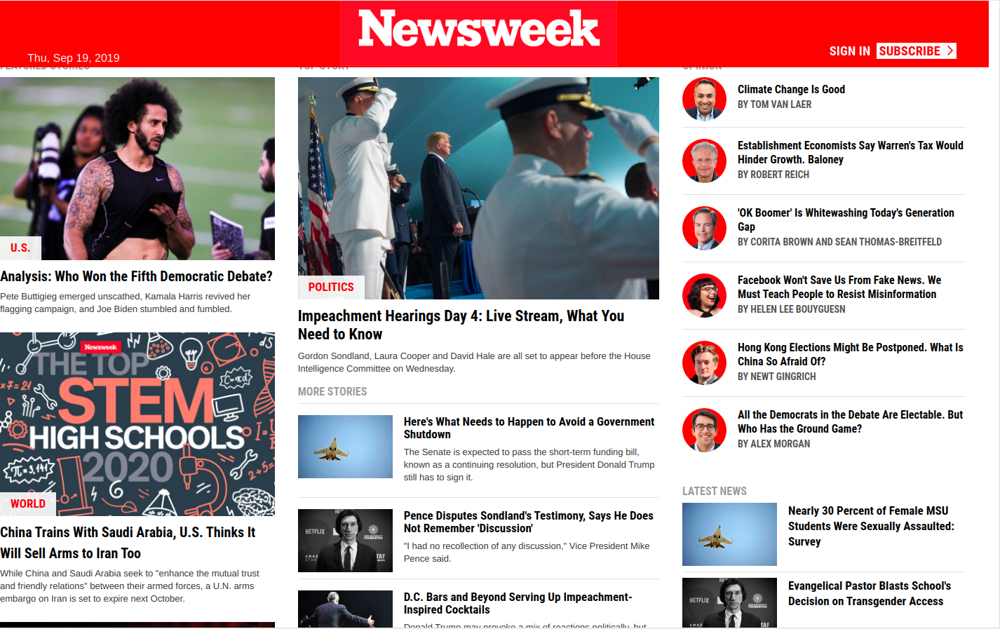
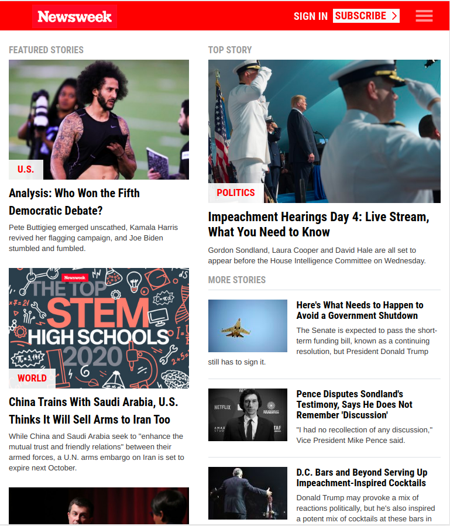
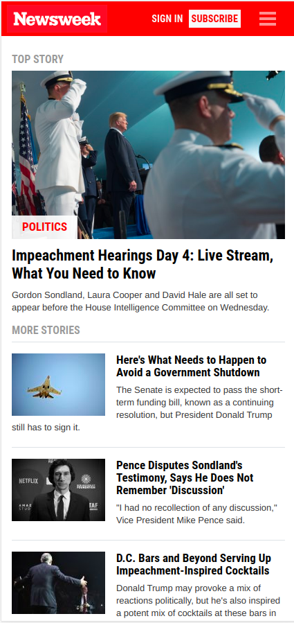

# using-bootstrap
This project consist of building a replica of the news site Newsweek.com using the Bootstrap Framework

<!--
*** Thanks for checking out this README Template. 
-->

<!-- PROJECT TITLE -->

 
<h1 align="center">USING BOOTSTRAP</h1>

    This project consist of building a replica of the news site Newsweek.com using the Bootstrap Framework
     

<!-- TABLE OF CONTENTS -->

## Table of Contents

* [About the Project](#about-the-project)
    * [Built With](#built-with)
* [Getting Started](#getting-started)
* [License](#license)
* [Contact](#contact)
* [Acknowledgements](#acknowledgements)
* [Commit Summary](#commit-summary)

<!-- ABOUT THE PROJECT -->
## About The Project

## Desktop size

  

## Tablet size

  

## Mobile size

  

### Built With 

* HTML
* CSS3
* Bootstrap 4
* Github

<!-- LIVE DEMO -->
## Live Demo

[Live Demo Link](https://ricardovaltierra.github.io/using-bootstrap/)

<!-- GETTING STARTED -->
## Getting Started

Just clone or download the project and open the index.html in your browser.

<!-- AUTHORS -->
## Authors

👤 **Author1**

- Github: [@ricardovaltierra](https://github.com/ricardovaltierra)
- Twitter: [@_ricardovr_](https://twitter.com/_ricardovr_)
- Linkedin: [Ricardo Abraham Valtierrra Ruiz](https://www.linkedin.com/in/ricardo-abraham-valtierrra-ruiz-3a07a849/)

## Show your support

Give a ⭐️ if you like this project!

<!-- ACKNOWLEDGEMENTS -->
## Acknowledgements

* Microverse.

<!-- LICENSE -->
## License

Distributed under the MIT License. See `LICENSE` for more information.
